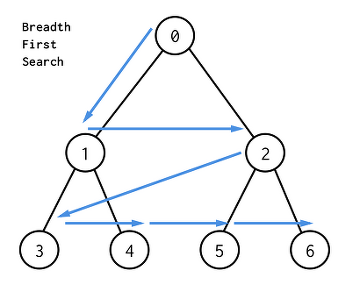
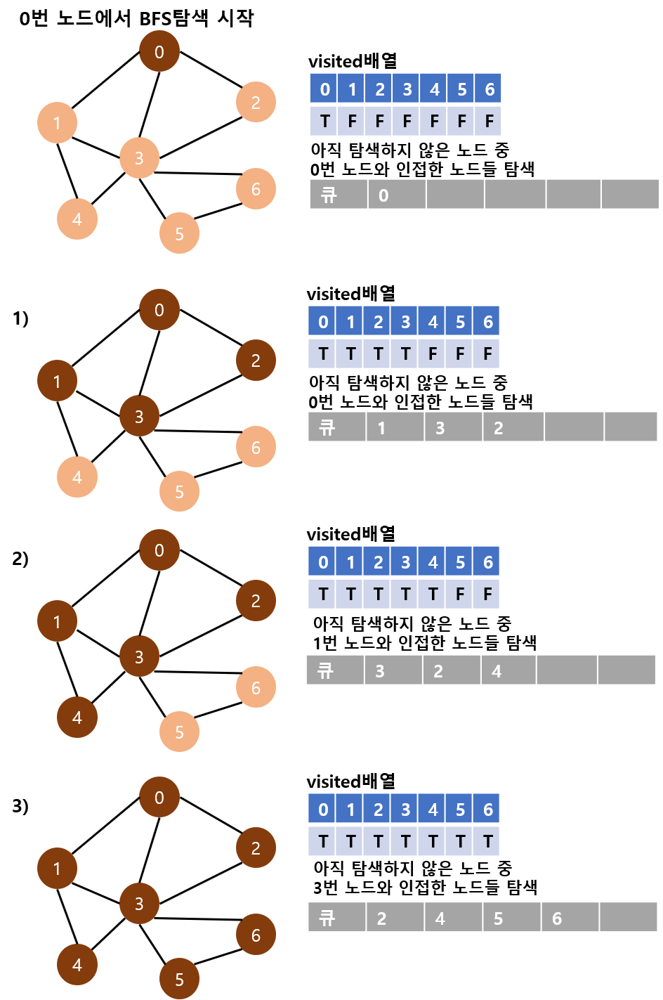
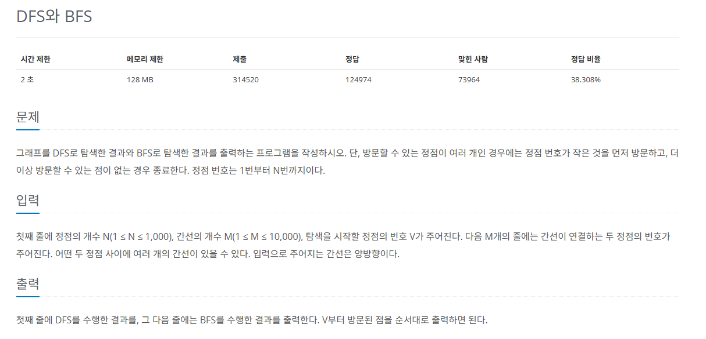

## 너비 우선 탐색(BFS)
* 그래프 `완전 탐색 기법` 중 하니아다.
* `시작 노드`에서 출발해 시작 노드를 기준으로 `가까운 노드`를 먼저 방문하면서 탐색

  

* 기능
  * 그래프 완전 탐색

* 특징
  * `FIFO` 탐색
  * `Queue` 자료구조 이용

* 시간 복잡도
  * O(V + E)

### 1. BFS를 시작할 노드를 정한 후 사용할 자료구조 초기화하기
* DFS와 마찬가지로 방문했던 노드는 다시 방문하지 않음.
* `방문 노드 체크 리스트` 필요
* 그래프를 `인접 리스트`로 표현.
* 스택이 아닌 `Queue` 사용

  

### 2. 큐에서 노드를 꺼낸 후 꺼낸 노드의 인접 노드를 다시 큐에 삽입
* 방문 리스트를 체크하며 이미 방문한 노드는 삽입하지 않음.
* 큐에서 꺼낸 노드는 탐색 순서에 기록.

### 3. 큐 자료구조에 값이 없을 때까지 반복
* `선입선출` 방식으로 탐색하므로 탐색 순서가 DFS와 다름.

## 문제
 
[백준 온라인 저지 1260번](https://www.acmicpc.net/problem/1260)

### 1. 인접 리스트에 그래프를 저장한다.
```
A = [[] for _ in range(N+1)]

for _ in range(M):
  s, e = map(int, input().split())
  A[s].append(e)
  A[e].append(s)
```
### 2. 작은 번호의 노드부터 탐색
* 인접 노드를 오름차순으로 정렬
* 재귀 함수를 호출

### 3. BFS 과정
#### 1) 큐 자료구조에 시작 노드 삽입
#### 2) visited 리스트에 현재 노드 방문 기록
#### 3) 큐가 비어 있을 때까지 while
#### 4) 큐에서 노드 데이터 가져오기
#### 5) 가져온 노드 출력
#### 6) 현재 노드의 연결 노드 중 미 방문 노드를 큐에 삽입
#### 7) 방문 리스트에 기록

## 결과
```
from collections import deque
N, M, Start = map(int, input().split())
A = [[] for _ in range(N+1)]

for _ in range(M):
    s, e = map(int, input().split())
    A[s].append(e) # 양방향 에지이므로 양쪽에 에지를 더하기
    A[e].append(s)

for i in range(N+1):
    A[i].sort() # 번호가 작은 노드부터 방문하기 위해 정렬하기

def DFS(v):
    print(v, end=' ')
    visited[v] = True
    for i in A[v]:
        if not visited[i]:
            DFS(i)

visited = [False] * (N+1)
DFS(Start)

def BFS(v):
    queue = deque()
    queue.append(v)
    visited[v] = True
    while queue:
        now_Node = queue.popleft()
        print(now_Node, end=' ')
        for i in A[now_Node]:
            if not visited[i]:
                visited[i] = True
                queue.append(i)

print()
visited = [False] * (N+1)
BFS(Start)
```