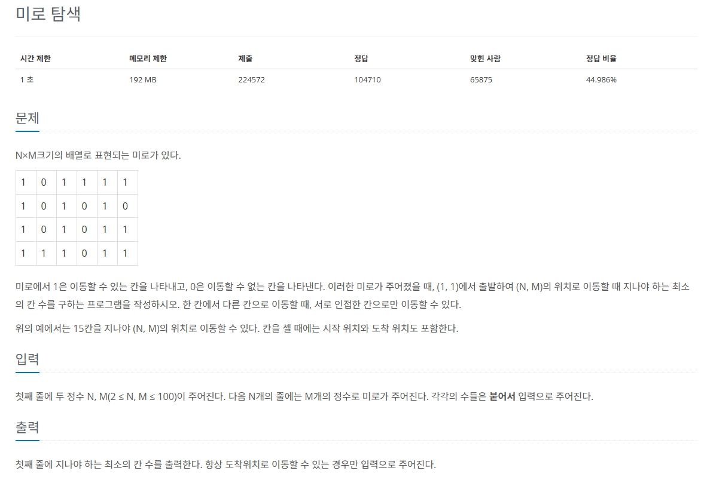

## 문제
 
[백준 온라인 저지 2178번](https://www.acmicpc.net/problem/2178)

### 1. 문제 분석하기
* N, M의 최대 데이터 100이므로 시간 제한은 생각하지 않아도 됨.
* `지나야 하는 칸 수의 최솟값`을 찾는 것
* `완전 탐색`에서 몇 번째 `깊이`에서 원하는 값을 찾는지 구하는 것
* `BFS`가 적합한 이유는 해당 깊이에서 갈 수 있는 노드 탐색을 마친 후 넘어가기 때문

### 2. 과정
#### 1) 2차원 리스트에 데이터 저장
#### 2) (1,1)에서 BFS 실행
#### 3) 상하좌우 네 방향의 인접한 칸을 봄
#### 4) 인접한 칸 숫자가 1이면서 아직 방문하지 않았다면 큐에 삽입
#### 5) 종료 지점(N,M)에서 BFS를 종료하며 깊이 출력

## 결과
```
from collections import deque
# 상하좌우를 탐색하기 위한 리스트 선언
dx = [0, 1, 0, -1]
dy = [1, 0, -1, 0]
N, M = map(int, input().split()) # 행, 열
A = [[0] * M for _ in range(N)]
visited = [[False] * M for _ in range(N)]

for i in range(N):
    numbers = list(input())
    for j in range(M):
        A[i][j] = int(numbers[j])

def BFS(i,j):
    queue = deque()
    queue.append((i, j))
    visited[i][j] = True

    while queue:
        now = queue.popleft()
        for k in range(4): # 상하좌우로 각각 옮기기 위한 반복문
            # k = 0 / dx[0] = 0 / dy[0] = 1 / 하
            # k = 1 / dx[1] = 1 / dy[1] = 0 / 우
            # k = 2 / dx[2] = 0 / dy[2] = -1 / 상
            # k = 3 / dx[3] = -1 / dy[3] = 0 / 좌
            x = now[0] + dx[k]
            y = now[1] + dy[k]
            if x >=0 and y >= 0 and x < N and y < M:
                if A[x][y] != 0 and not visited[x][y]:
                    visited[x][y] = True
                    # 현재 깊이에서 이동했으므로 현재 깊이에 1 누적
                    A[x][y] = A[now[0]][now[1]] + 1 
                    queue.append((x,y))

BFS(0, 0)
print(A[N-1][M-1])
```