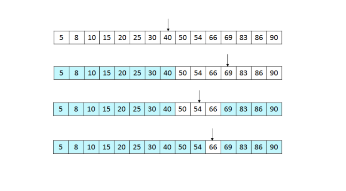

## 이진 탐색(Binary Search)
* 데이터가 `정렬`돼 있는 상태에서 원하는 값을 찾아내는 알고리즘
* 대상 데이터의 `중앙값`과 `찾고자 하는 값`을 `비교`
* 데이터의 크기를 `절반씩 줄이면서` 대상을 찾음
* 정렬 데이터에서 원하는 데이터를 탐색할 때 가장 일반적인 알고리즘

* 기능
  * 타깃 데이터 탐색

* 특징
  * 중앙값 비교를 통한 대상 축소 방식

* 시간 복잡도
  * O(logN)

 

#### 1. 현제 데이터셋의 중앙값(median)을 선택한다.
#### 2. 중앙값 > 타깃 데이터(target data)일 때 중앙값 기준으로 왼쪽 데이터셋을 선택한다.
#### 3. 중앙값 < 타깃 데이터일 때 중앙값 기준으로 오른쪽 데이터셋을 선택한다.
#### 4. 과정 1~3을 반복하다가 중앙값 == 타깃 데이터일 때 탐색을 종료한다.

## 문제
   
[백준 온라인 저지 1920번](https://www.acmicpc.net/problem/1920)

### 1. 문제 분석하기
* N의 최대 범위가 1000,000 이므로 반복문 하면 1억이 넘어서 풀 수 없음.
* 정렬 함수까지 고려하면 nlogn의 이진 탐색으로 풀 수 있음.

### 2. 과정
#### 1) 탐색 데이터를 1차원 리스트에 저장한 다음 이를 정렬
#### 2) 이진 탐색으로 확인
* 중앙값 = (start_index + end_index) / 2
* 중앙값을 이용해 왼쪽, 오른쪽 선택을 판단하고 중앙값을 이용해 start_index, end_index 를 재정의한다.

## 결과
```
N = int(input())
A = list(map(int, input().split()))
A.sort()
M = int(input())
target_list = list(map(int, input().split()))

for i in range(M):
    find = False
    target = target_list[i]
    # 이진 탐색
    start = 0
    end = len(A) - 1
    while start <= end:
        midi = int((start + end) / 2)
        midv = A[midi]
        if midv > target:
            end = midv - 1
        elif midv < target:
            start = midv + 1
        else:
            find = True
            break
    if find:
        print(1)
    else:
        print(0)
```


