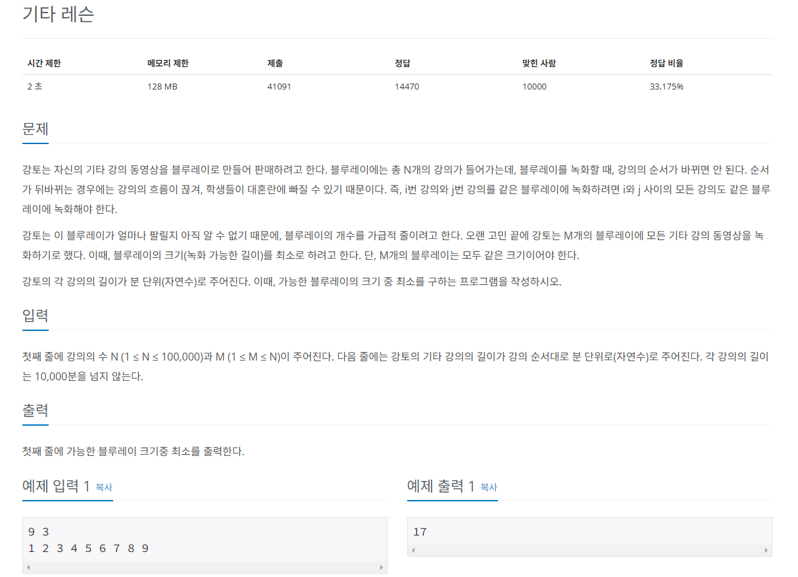

## 문제
   
[백준 온라인 저지 2343번](https://www.acmicpc.net/problem/2343)

### 1. 문제 분석하기
* 이진 탐색의 단서
  * 블루레이의 크기가 모두 같고, 녹화 순서가 바뀌지 않아야 함.
  * 블루레이 개수는 정해져 있음.
  * 레슨을 차례로 저장, 모두 저장할 수 있다면 크기를 줄임.
  * 모두 저장할 수 없다면 크기를 늘림.

### 2. 과정
#### 1) 시작 인덱스와 종료 인덱스
* 시작 인덱스 : 최대 길이의 레슨 = 9
  * 블루레이 자체가 9분을 녹화할 수 없으면 안되기 때문.
* 종료 인덱스 : 모든 레슨 길이의 합 = 45
* 블루레이 개수 : 3

#### 2) 이진 탐색 수행
* 9와 45 사이에서 수행
* 중앙값 크기로 모든 레슨을 저장할 수 있으면 종료 인덱스 = 중앙값 - 1
* 중앙값 크기로 모든 레슨을 저장할 수 없으면 시작 인덱스 = 중앙값 + 1
  * (9 + 45) / 2 = 27
  * 27분 내에 저장할 수 있는 레슨 집합 (1+2+3+4+5+6), (7+8+9) -> 2장으로 가능.
  * 중앙값 재설정. (9 + 26) / 2 = 17
  * 17분 내에 저장할 수 있는 레슨 집합 (1+2+3+4+5), (6+7), (8+9) -> 3장으로 가능.
  * 중앙값 재설정. (9 + 16) / 2 = 12
  * 12분 내에 저장할 수 있는 레슨 집합 (1+2+3+4), (5+6), (7)... -> 3장으로 불가능.
  * 중앙값 재설정. (13 + 16) / 2 = 16
  * 16분 내에 저장할 수 있는 레슨 집합 (1+2+3+4+5), (6+7), (8)... -> 3장으로 불가능.
  * start 값이 17 으로 바뀌어햐 하는데 end 값인 16보다 커지므로 탐색 종료
  * start 값 출력

## 결과
```
N, M = map(int, input().split())
A = list(map(int, input().split()))
start = 0
end = 0

for i in A:
    if start < i:
        start = i # 레슨 최대값을 시작 인덱스로 저장
    end += i # 모든 레슨의 총합을 종료 인덱스로 저장

while start <= end:
    middle = int((start + end) / 2)
    sum = 0
    count = 0
    for i in range(N): # 중간값으로 모든 레슨을 저장할 수 있는지 확인
        if sum + A[i] > middle:
            # 현재 블루레이에 저장할 수 없어 새로운 블루레이로 교체한다는 의미
            count += 1
            sum = 0
        sum += A[i]

    if sum != 0:
        # sum이 0이 아니면 새로운 블루레이가 필요하므로 count 값 올리기
        count += 1
    if count > M:
        # 중간 인덱스값으로 모든 레슨 저장 불가능
        start = middle + 1
    else:
        end = middle - 1

print(start)
```
