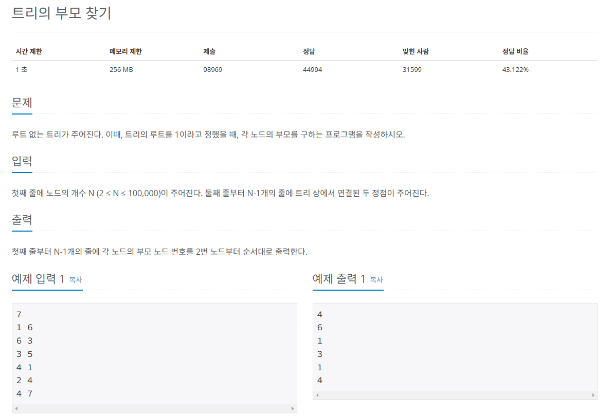
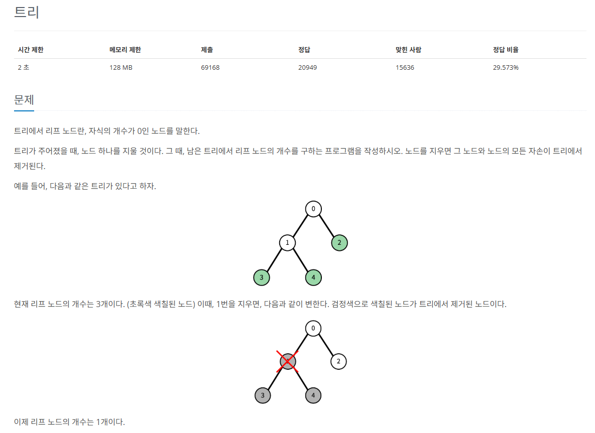

# 트리 알아보기
`노드`와 `에지`로 연결된 그래프의 특수한 형태

* 트리의 특징
  * 순환 구조(사이클)을 지니고 있지 않고, 1개의 루트 노드가 존재
  * 루트 노드를 제외한 노드는 단 1개의 부모 노드를 가진다.
  * 트리의 부분 트리 역시 트리의 모든 특징을 따른다


## 트리의 핵심 이론
* `노드` : 데이터의 index와 value를 표현하는 요소
* `에지` : 노드와 노드의 연결 관계를 나타내는 선
* `루트 노드` : 트리에서 가장 상위에 존재하는 노드
* `부모 노드` : 두 노드 사이의 관계에서 상위 노드에 해당하는 노드
* `자식 노드` : 두 노드 사이의 관계에서 하위 노드에 해당하는 노드
* `리프 노드` : 트리에서 가장 하위에 존재하는 노드(자식 노드가 없는 노드)
* `서브 트리` : 전체 트리에 속한 작은 트리

## 문제


[백준 온라인 저지 11725번](https://www.acmicpc.net/problem/11725)

### 1. 문제 분석하기
* 주어지는 데이터가 단순하게 연결돼 있는 두 노드를 알려주는 것이므로 데이터를 저장할 때 `양방향 에지`로 간주하고 저장한다.
* `인접 리스트`로 저장한다.
* 트리의 루트가 1이라고 지정돼 있기 때문에 **1번 노드부터** `DFS`로 탐색하면서 부모 노드를 찾기

### 2. 과정

1. `인접 리스트`로 `트리` 데이터를 구현한다.
2. `DFS 탐색`을 수행한다. 수행할 때는 부모 노드의 값을 정답 리스트에 저장한다.
3. 정답 리스트의 2번 인덱스부터 값을 차례대로 출력한다.

## 결과
```python
sys.setrecursionlimit(10**6)

N = int(input())
visited = [False] * (N+1)
tree = [[] for _ in range(N+1)]
answer = [0] * (N+1)

for _ in range(1, N):
    n1, n2 = map(int, input().split())
    tree[n1].append(n2)
    tree[n2].append(n1)

# DFS 탐색 함수
def DFS(number):
    visited[number] = True
    for i in tree[number]:
        if not visited[i]:
            # DFS를 수행하면서 부모 노드를 정답 리스트에 저장
            answer[i] = number
            DFS(i)

# 부모 노드부터 DFS 시작
DFS(1)

for i in range(2, N+1):
    print(answer[i])
```

## 문제


[백준 온라인 저지 1068번](https://www.acmicpc.net/problem/1068)

### 1. 문제 분석하기
* 문제의 핵심은 **'리프 노드를 어떻게 제거하는가?'**
* **리프 노드를 탐색하는 탐색 알고리즘을 수행할 때**나 **제거하는 노드가 나왔을 때** `탐색을 종료`하는 아이디어를 적용

### 2. 과정

1. `인접 리스트`로 트리 데이터를 구현합니다.
2. `DFS 또는 BFS 탐색`을 수행하면서 리프 노드의 개수를 센다.
* 단, **제거 대상 노드를 만났을 때 그 아래 자식 노드들과 관련된 탐색은 중지**

## 결과
```python
# 재귀 함수를 위해 충분히 큰 수로 한곗값 설정
sys.setrecursionlimit(10**6)

N = int(input())
visited = [False] * (N)
tree = [[] for _ in range(N)]
answer = 0
p = list(map(int, input().split()))

for i in range(N):
    if p[i] != -1:
        tree[i].append(p[i])
        tree[p[i]].append(i)
    else:
        root = i

# DFS 탐색 함수
def DFS(number):
    global answer
    visited[number] = True
    cNode= 0
    
    for i in tree[number]:
        if not visited[i] and i != deleteNode: # 삭제 노드일 때도 탐색 중지
            cNode += 1
            DFS(i)
    if cNode == 0:
        answer += 1 # 자식 노드 수가 0개일 때 리프 노드로 간주하고 정답 값 증가

deleteNode = int(input())

if deleteNode == root:
    print(0)
else:
    DFS(root)
    print(answer)
```