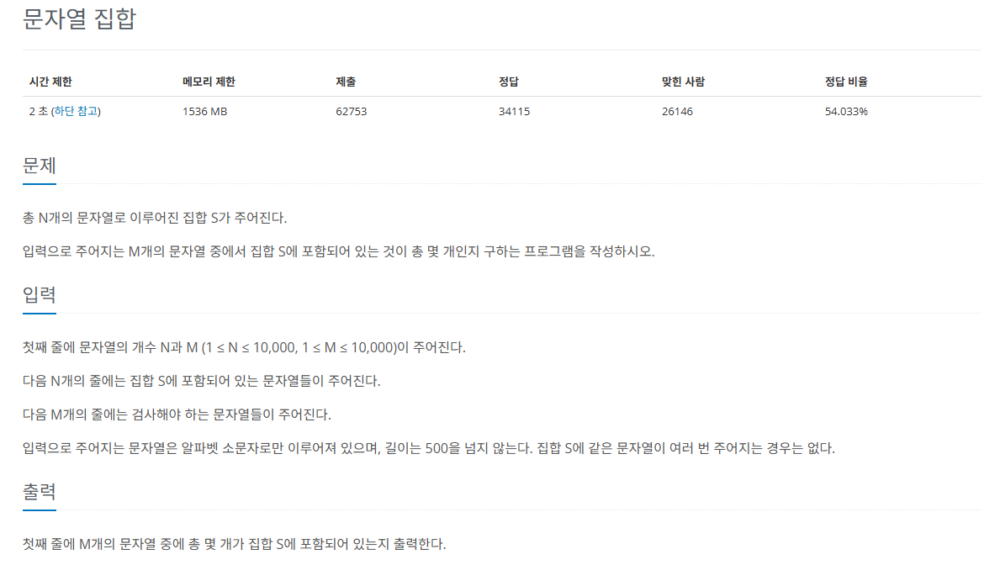

# 트라이

문자열 검색을 바르게 실행할 수 있도록 설계한 트리 형태의 자료구조

## 트라이의 핵심 이론

일반적으로 단어들을 사전의 형태로 생성한 후 **트리의 부모 자식 노드 관계**를 이용해 검색을 수행한다.

* 트라이의 특징
  * `N진 트리` : **문자 종류의 개수**에 따라 N이 결정된다. 예를 들어 알파벳은 26개의 문자로 이뤄져 있으므로 26진 트리로 구성된다.
  * `루트 노드`는 **항상 빈 문자열을 뜻하는 공백 상태**를 유지한다.
  
* 루트 노드는 공백을 유지하고 APPLE의 각 알파벳에 해당하는 노드를 생성
* AIR를 삽입할 때는 루트 노드에서부터 검색
* A 노드는 공백 상태가 아니므로 이동하고, I와 R은 공백 상태이므로 신규 노드를 생성

## 문제

[백준 온라인 저지 14425번](https://www.acmicpc.net/problem/14425)

### 1. 문제 분석하기

* 집합 S에 속해있는 단어들을 이용해 `트라이 구조`를 생성하고, `트라이 검색`을 이용해 **문자열 M개의 포함 여부를 카운트**

* 전형적인 `트라이` 자료구조 문제

### 2. 과정

1. 트라이 자료구조 생성
* 현재 문자열을 가리키는 위치의 노드가 공백 상태라면 신규 노드를 생성하고, 아니라면 이동한다.
* 문자열의 마지막에 도달하면 리프 노드라고 표시

2. 집합 S에 포함된 문자열을 센다.
* 부모-자식 관계 구조를 이용해 대상 문자열을 검색했을 때 문자열이 끝날 때까지 공백 상태가 없고, 현재 문자의 마지막 노드가 트라이의 리프 노드라면 이 문자를 집합 S에 포함된 문자열로 센다.
