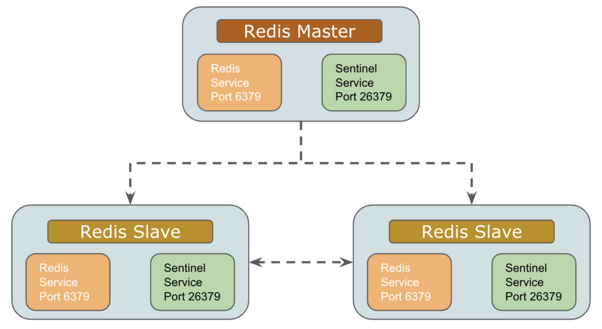

# 1. Redis 기본

   
[Redis 공식문서](https://redis.io)
#### *Redis*는 오픈 소스 `인메모리` 데이터 구조 스토어로, `키-값` 데이터베이스, 캐시 및 메시지 브로커로 사용된다. 

* 인메모리 데이터 저장
> `모든 데이터를 메모리에 저장`하여 빠른 읽기 및 쓰기 성능을 제공한다.
* 다양한 데이터 구조
> 문자열, 리스트, 세트, 해시, 정렬된 세트 등 다양한 데이터 구조를 지원한다.
* 지속성
> 메모리 내 데이터를 디스크에 저장하여 영구 저장을 지원한다.
* 복제 및 고가용성
> `마스터-슬레이브` 복제를 통해 데이터 복제 및 고가용성을 보장한다.
* Lua 스크립팅
> 서버 측에서 Lua 스크립트를 실행할 수 있다.
*  트랜잭션
> 원자적 트랜잭션을 지원하여 데이터 일관성을 유지한다.

## 1.1. Redis의 영속성
#### Redis는 주로 메모리 기반이지만 `데이터 영속성`을 지원한다. 다음은 Redis에서 사용하는 주요 영속성 방식이다.

### 1.1.1. RDB (Redis Database Backup)
> RDB는 Redis 서버의 데이터를 `특정 시간 간격`마다 `스냅샷`으로 저장하는 방식이다. RDB 파일은 특정 시점의 데이터를 디스크에 저장하며, Redis 서버가 재시작되거나 장애가 발생할 경우 해당 시점의 상태로 복원할 수 있다.

* RDB의 장점
  * 디스크 I/O 절감
    * RDB는 `주기적`으로만 데이터를 저장하므로, 시스템의 디스크 I/O가 비교적 낮음.
  * 빠른 시작 시간
    * RDB 파일은 `바이너리 형식`이므로, 서버 재시작 시 데이터를 빠르게 로드할 수 있음.
  * 백업 편리성
    * RDB 파일은 하나의 스냅샷 파일로 구성되므로, 파일을 복사하여 다른 서버에 쉽게 백업할 수 있음.

* RDB의 단점
  * 데이터 유실 가능성
    * RDB는 주기적으로 스냅샷을 저장하므로, 두 스냅샷 사이에 발생한 데이터는 유실될 수 있음.
  * 큰 스냅샷 생성 비용
    * 대규모 데이터 세트에서 스냅샷 생성 시 서버 성능이 일시적으로 저하될 수 있음.

* RDB 활용 방안
  * `백업` 목적으로 주기적 스냅샷 저장
    * 데이터 변경이 적거나 데이터 유실이 큰 문제가 되지 않는 시스템에서 사용 가능. 예를 들어, 주기적으로 업데이트되는 캐시 서버에서 유용함.
  * 시스템 재시작 시 `빠른 복원`
    * 애플리케이션이 빠르게 복구되어야 하는 상황에서 RDB 파일로부터 데이터를 빠르게 로드해 복원할 수 있음.

### 1.1.2. AOF (Append-Only File)
> AOF는 Redis가 처리한 `모든 쓰기 작업`을 `로그 파일`에 순차적으로 기록하는 방식이다. AOF는 데이터가 변경될 때마다 즉시 파일에 기록되며, Redis 서버가 재시작될 때 로그 파일을 다시 재생하여 데이터 상태를 복원힌다.

* AOF의 장점
  * 더 작은 데이터 유실 가능성
    * AOF는 거의 `실시간`으로 데이터를 기록하므로, 데이터 유실 위험이 적음. fsync 설정에 따라 데이터 유실 여부를 결정할 수 있음.
  * 명령 기반 복구
    * AOF 파일은 Redis 명령어로 작성되어, 텍스트로 읽고 수정이 가능함.
  * 재구성 가능
    * AOF 파일을 압축하여 로그 크기를 줄이고 시스템 성능을 최적화할 수 있음.

* AOF의 단점
  * 디스크 I/O 부담
    * 모든 쓰기 작업이 디스크에 기록되므로, 디스크 I/O가 RDB보다 높아질 수 있음.
  * 시작 시간 지연
    * AOF 파일이 커지면, 서버 재시작 시 로그 파일을 재생하는 데 시간이 오래 걸릴 수 있음.

* AOF 활용 방안
  * 데이터 유실이 중요한 시스템
      * 금융 데이터, 중요한 사용자 데이터 등이 저장되는 시스템에서 AOF를 활용해 `데이터 유실을 최소화`.
  * 실시간 데이터 복구 필요
      * 매우 짧은 시간 간격으로 데이터를 복구해야 할 때 AOF를 사용하여 최소한의 데이터 손실로 복구 가능.
  * 최적화 설정
      * 성능과 데이터 안전성 간 균형을 맞추기 위해 fsync 옵션을 적절하게 조정 (fsync=always, fsync=everysec, fsync=no).

### 1.1.3. RDB와 AOF의 병행 사용
> Redis는 RDB와 AOF를 동시에 사용할 수 있으며, 이를 통해 서로의 단점을 보완하고 데이터의 영속성과 성능을 최적화할 수 있다.

* `RDB`는 `주기적인 백업`으로 사용하고, `AOF`는 `실시간 복구용`으로 설정하여 데이터 손실을 최소화하면서도 성능 저하를 방지할 수 있음.
* Redis 서버 재시작 시 `AOF 파일`을 우선 복원하여 `최신 상태`를 복구하고, `RDB`는 `긴급 복구용`으로 활용 가능.

### 1.1.4. 최적 활용을 위한 설정 예시
* AOF와 RDB 병행 사용 설정: `redis.conf`에서 다음과 같이 설정할 수 있다.
```
save 900 1
save 300 10
save 60 10000
appendonly yes
appendfsync everysec
```
  * 이 설정은 15분마다, 5분 동안 10번 변경된 경우, 1분 동안 10,000번의 변경이 발생하면 RDB 스냅샷을 저장하며, AOF는 1초마다 기록한다.

### 1.1.5. 활용 시 고려사항
*  데이터 일관성 요구사항
   * 시스템에서 데이터 일관성을 어느 정도까지 보장해야 하는지에 따라 AOF와 RDB의 설정을 조정.
*  성능 요구사항
   * 성능이 중요한 시스템에서는 RDB를 사용하거나 AOF의 `fsync` 옵션을 `everysec`으로 설정하여 성능을 최적화.
*  디스크 사용량
   * AOF는 로그 파일이 계속해서 커질 수 있으므로, 주기적으로 로그를 압축하는 AOF 재작성(AOF rewrite)을 수행해야 함.

## 1.2. Redis의 복제(Replication)
#### Redis는 `마스터-슬레이브` 복제를 지원한다. 데이터는 `마스터에서 슬레이브로 복제`되며, `슬레이브`는 `읽기 전용`으로 활용 가능하여 읽기 부하를 분산할 수 있다.

   

## 1.3. Redis 클러스터
* 데이터 `샤딩`을 통해 대규모 데이터 세트를 여러 노드에 분산 저장.
* `자동 장애 조치(Failover)`를 지원하여 하나의 노드가 다운되면 다른 노드가 대신 역할을 수행.
* Slot 기반 샤딩
  * 데이터를 `16,384개의 슬롯`에 할당하며 각 슬롯은 특정 노드에 매핑.

    

## 1.4. 사용 사례
* `캐싱`
  * 자주 접근하는 데이터를 캐시하여 빠르게 조회.
* `세션` 관리
  * 웹 애플리케이션에서 사용자의 세션 데이터를 저장.
* 메시지 브로커
  * Pub/Sub 기능을 사용하여 메시지 큐로 활용.
* 순위표 관리
  * `Sorted Set`을 사용해 사용자 점수를 관리하고 순위를 계산.

## 1.5. Redis의 고급 기능
* Pub/Sub
  * 메시지 발행과 구독을 통해 실시간 통신 가능.
* Lua 스크립트
  * 서버에서 원자적으로 실행 가능한 스크립트 작성 가능.
* 트랜잭션
  * 여러 명령어를 하나의 원자적 연산으로 묶어 실행.