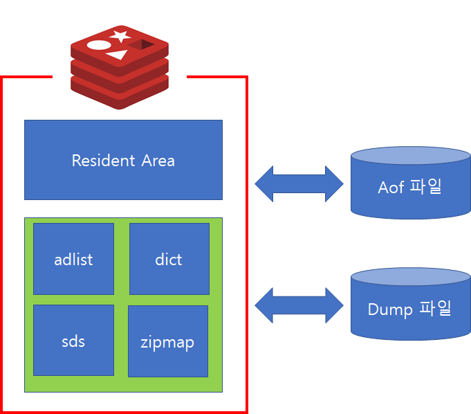

# 3. Redis 서버 구조와 동작 방식
## 3.1. Redis 서버 구조
>**Redis**는 `클라이언트-서버` 모델로 동작하며, 클라이언트가 서버에 `요청(request)`을 보내고, 서버가 이를 처리하여 `응답(response)`을 반환하는 방식이다. Redis 서버는 다음과 같은 주요 구성 요소로 이루어져 있다.

* **서버 (Server)**
  * Redis는 `단일 스레드`로 동작하는 서버 프로세스이다. 서버는 클라이언트의 요청을 처리하고 데이터를 저장하거나 반환하는 역할을 한다.
* **데이터베이스 (Database)**
  * Redis는 여러 개의 데이터베이스를 관리할 수 있으며, 기본적으로 `0번부터 15번까지`의 데이터베이스가 제공된다. 데이터베이스는 `서로 독립적`이지만 `하나의 서버 인스턴스`에 의해 관리된다.
* **클라이언트 (Client)**
  * 클라이언트는 Redis 서버에 연결되어 `데이터를 읽거나 쓰는 역할`을 한다. 대부분의 애플리케이션이 클라이언트를 통해 Redis에 접근한다.
* **디스크 저장 (Persistence)** 
  * Redis는 기본적으로 `메모리 기반`의 저장소지만, 데이터를 영구적으로 저장하기 위한 메커니즘을 제공한다.

  

## 3.2. 동작 방식
>**Redis**의 기본적인 동작 방식은 다음과 같다.

* **메모리 기반**
  * Redis는 데이터를 `메모리`에 저장하기 때문에 `매우 빠른 읽기/쓰기` 성능을 자랑한다. 이로 인해 주로 캐시, 세션 저장소, 실시간 분석 등에 사용된다.

* **단일 스레드 (Single-threaded)**
  * Redis는 대부분의 작업을 `단일 스레드`에서 처리한다. 이는 동시성 문제가 적고, 단일 코어 CPU의 성능을 최대한 활용할 수 있게 해준다. 하지만 멀티 코어 CPU를 사용하고 싶다면 여러 개의 Redis 인스턴스를 실행하는 방법으로 병렬 처리할 수 있다.

* **명령어 기반 프로토콜**
  * Redis는 텍스트 기반의 프로토콜을 사용하여 클라이언트와 서버 간에 명령을 주고받는다. 대표적인 명령어로는 `SET`, `GET`, `DEL` 등이 있다.

  

* **Persistence (데이터 영구 저장)**
  * Redis는 데이터를 `디스크에 저장`하는 방법을 제공하여 시스템 재시작이나 서버 오류 발생 시에도 데이터를 복구할 수 있다. 
  * `RDB (Redis Database)`: `일정 시간 간격`으로 메모리의 데이터를 `스냅샷` 형태로 디스크에 저장한다. 스냅샷은 주기적으로 일어나며, 시스템 오류 시 스냅샷 시점 이후의 데이터는 손실될 수 있다.
  
  * `AOF (Append Only File)` : 모든 `쓰기 명령`을 `로그로 기록`하여 재시작 시 순차적으로 로그를 실행하여 데이터를 복구한다. AOF는 RDB보다 더 많은 디스크 공간을 차지할 수 있지만, 복구 시 `더 적은 데이터 손실`을 보장한다.

  

* **복제 (Replication)**
  * Redis는 `마스터-슬레이브` 구조로 데이터를 복제할 수 있다. `마스터 노드`는 `데이터를 처리`하고, `슬레이브 노드`는 이를 복제하여 `백업 용도`로 사용된다. `슬레이브`는 `읽기 전용`으로 사용될 수 있으며, 마스터가 다운되면 슬레이브가 마스터로 `승격`될 수 있다.

### 3.2.1.  스탠드얼론 모드 (Standalone Mode)
*  개요
   * 스탠드얼론 모드에서는 `Redis 서버 하나`가 `모든 요청`을 처리하고, 모든 데이터를 저장하는 방식이다.
   * 이 모드는 `단일 인스턴스`로 동작하며, `작은 규모`의 애플리케이션에 적합하다.
   * 데이터가 한 서버에 집중되어 있기 때문에 서버에 문제가 생기면 서비스가 중단될 수 있다.
   * 이를 **단일 장애 지점(SPOF)** 이라고 한다.

*  장점
   * 설정이 매우 간단하고, 설치와 유지 관리가 용이하다.
   * 작은 규모의 프로젝트에 적합하며, Redis의 고속 성능을 그대로 활용할 수 있다.

*  단점
   * 단일 장애 지점(SPOF): 하나의 서버에 모든 데이터와 요청이 집중되므로 서버가 중단되면 데이터 접근이 불가능하다.
   * 확장성의 제한: 단일 서버의 성능과 메모리 용량이 한계가 될 수 있다.

### 3.2.2. Redis 클러스터 모드 (Cluster Mode)

 

*  개요
   * Redis 클러스터 모드는 데이터를 `여러 Redis 노드`에 `분산`하여 저장하는 방식이다. 이는 대규모의 데이터 처리를 위한 `확장성`을 제공한다.
   * 데이터를 `해시 슬롯(hash slot)` 이라는 논리적 단위로 나누고, 이를 `여러 마스터 노드에 분배`하여 저장한다.
   * 클러스터 모드는 `높은 가용성`과 `수평 확장성`을 제공한다. 노드 중 일부가 장애를 일으켜도 서비스가 중단되지 않는다.

* 데이터 분산 방식
   * Redis 클러스터는 전체 데이터를 `16,384개`의 `해시 슬롯`으로 나눈다.
   * `각 노드`는 이 `해시 슬롯 중 일부`를 담당하며, 키-값 쌍은 특정 해시 슬롯에 저장된다. 클라이언트는 키에 대한 해시 계산을 통해 어느 노드가 해당 키를 가지고 있는지 찾는다.

*  구조
   * `마스터-슬레이브` 구조: 각 마스터 노드는 `자신이 담당`하는 `해시 슬롯`에 `데이터를 저장`하며, 해당 마스터의 `복제본`으로 `슬레이브 노드`가 존재한다.
   * `Failover`: 마스터 노드가 `장애`를 일으키면, 해당 마스터의 `슬레이브 노드` 중 하나가 자동으로 `마스터로 승격`된다.
   * `샤딩(Sharding)`: Redis 클러스터는 키-해시 슬롯 맵핑을 통해 데이터를 여러 노드에 `분산 저장함`으로써 데이터를 샤딩한다.

*  장점
   * `수평 확장성`: 노드를 추가함으로써 데이터 저장 용량을 확장할 수 있으며, 높은 트래픽을 분산 처리할 수 있다.
   * `고가용성`: 마스터-슬레이브 복제 구조와 `자동 장애 복구` 메커니즘을 통해 고가용성을 보장한다.

*  단점
   * `설정이 복잡`하며, 운영 관리가 어렵다.
   * 클러스터 간의 네트워크 지연이나 `파티션 문제`가 발생할 수 있으며, 이는 데이터 일관성에 영향을 미칠 수 있다.

### 3.2.3. 센티넬 모드 (Sentinel Mode)

 

*  개요
   * Redis `센티넬(Sentinel)`은 고가용성을 보장하기 위한 `감시 시스템`이다.
`마스터-슬레이브 복제 구조`에서 `마스터 노드가 장애`를 일으키면, 센티넬이 슬레이브 노드 중 하나를 새로운 마스터로 `승격`시켜 `자동으로 장애를 복구`한다.

*  기능
   * `감시 (Monitoring)`: Redis 서버(마스터 및 슬레이브)를 주기적으로 모니터링하여 장애를 감지한다.
   * `자동 페일오버 (Failover)`: 마스터 노드에 장애가 발생하면, 센티넬은 슬레이브 중 하나를 마스터로 승격시킨다.
   * `알림 (Notification)`: 장애 발생 시 관리자에게 알림을 전송하여 빠르게 문제를 해결할 수 있도록 한다.
   * `구성 관리 (Configuration Management)`: 센티넬은 Redis 클러스터의 구성을 동적으로 관리하며, 새로운 마스터가 설정되면 클러스터 내 모든 노드에 이를 알린다.

*  구조와 동작 방식
   * `센티넬 프로세스`: Redis 센티넬은 `별도의 프로세스`로 동작하며, 여러 대의 센티넬을 `클러스터로 구성`할 수 있다. 다수의 센티넬이 존재할 경우 장애 감지 및 복구가 더욱 안정적으로 수행된다.
   * `쿼럼(Quorum)`: `마스터 노드의 장애를 감지`하기 위해 센티넬은 쿼럼 방식을 사용한다. 일정 수 이상의 센티넬이 마스터가 다운되었다고 판단하면, 페일오버 절차를 시작한다.
   * `슬레이브 승격`: 센티넬은 기존 슬레이브 중 하나를 마스터로 승격하고, 다른 슬레이브들은 새로운 마스터에게 복제되도록 재구성한다.

*  장점
   * 단일 장애 지점을 방지할 수 있으며, `자동으로 장애 복구`를 지원한다.
   * Redis의 마스터-슬레이브 복제 구성을 통해 고가용성을 유지할 수 있다.
`설정이 클러스터 모드보다 간단`하며, 적은 노드로도 고가용성을 확보할 수 있다.

*  단점
   * 클러스터 모드에 비해 `수평 확장성은 부족`하다.
   * 데이터를 샤딩할 수 없으므로, 하나의 마스터 노드가 처리할 수 있는 데이터 양에 한계가 있다.