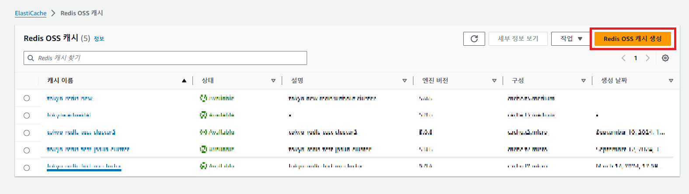
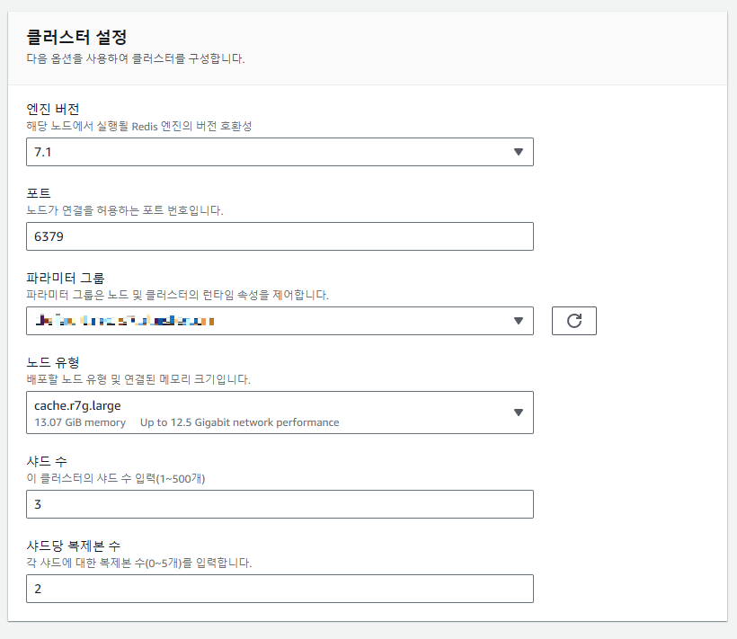
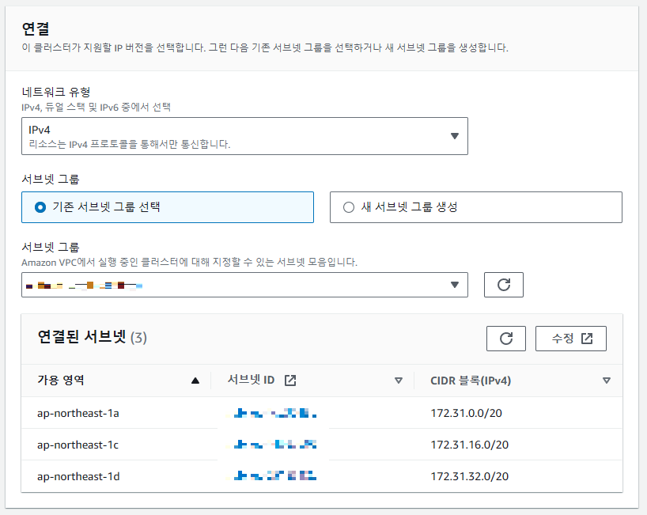

> `AWS ElastiCache`를 이용하여 `Redis 인스턴스`를 생성하는 단계는 매우 간단하다. ElastiCache는 Redis와 Memcached를 지원하는 완전 관리형 서비스로, 클러스터 설정, 백업, 모니터링 등을 손쉽게 관리할 수 있게 도와준다. 아래는 ElastiCache에서 Redis 인스턴스를 생성하는 방법이다.

## 1. AWS Management Console에 로그인
먼저 **AWS 관리 콘솔**에 로그인한다.

## 2. ElastiCache 서비스로 이동
* AWS Management Console에서 서비스 목록 중 `ElastiCache`를 선택한다.
* `Redis`를 선택하여 Redis 인스턴스를 생성한다.

## 3. Redis 클러스터 생성
ElastiCache 콘솔에서 Redis 클러스터 생성을 시작한다.

   

#### 3.1. **"클러스터 생성" 클릭** ElastiCache 대시보드에서 "Create" 버튼을 클릭하여 새 클러스터 생성 화면으로 이동한다.

#### 3.2. 캐시 엔진 선택

* `Redis`를 선택한다.
* **엔진 버전**을 선택할 수 있다. 최신 버전을 사용하는 것이 좋다.

 

#### 3.3.클러스터 모드 선택

* **Cluster 모드 활성화** : 여러 샤드를 사용해 데이터 파티셔닝이 필요한 경우 선택한다.
* **Cluster 모드 비활성화** : 단일 샤드로 구성된 Redis를 사용할 경우 선택한다.


## 4. 클러스터 세부 정보 설정
 * 이름
   * 클러스터 이름을 설정한다. 예: my-redis-cluster

 * 노드 유형
   * 사용하려는 노드 유형을 선택한다. (예: cache.t3.micro, cache.r6g.large 등)

 * 노드 수
   * 노드 수를 선택한다. (Cluster 모드 활성화 시 여러 샤드를 사용할 수 있다.)

 * 복제 그룹 구성
   * Master-Slave 복제를 설정하여 고가용성을 보장한다. 보통 1개의 마스터 노드와 1~2개의 복제 노드를 설정한다.



## 5. 네트워크 설정
 * VPC
   * Redis 인스턴스를 배포할 가상 네트워크(VPC)를 선택한다.

 * 서브넷 그룹
   * Redis 인스턴스를 어느 서브넷에 배포할지 선택한다. 
   * 여러 가용 영역에 분산된 서브넷을 사용하는 것이 권장된다.

 * 보안 그룹
    * Redis 인스턴스의 접근 권한을 설정할 보안 그룹을 선택한다.
    * 이 설정을 통해 특정 IP나 VPC 내 리소스만 접근 가능하게 할 수 있다.



## 6. 고가용성 및 백업 설정
 * 자동 백업
   * 백업을 설정하고 보관 기간을 지정할 수 있다.
   * 보통 1~35일 사이로 설정할 수 있다.

 * 복구
   * Redis 클러스터 장애 발생 시 자동으로 노드를 교체해주는 기능을 활성화할 수 있다.

 * 복제
   * 복제본을 설정하여 자동 장애 조치(Failover)를 사용할 수 있다.

## 7. 모니터링 및 암호화 설정
 * Redis 암호화
   * Redis에 대한 연결 암호화 및 데이터 암호화 여부를 설정한다.

 * 모니터링
   * CloudWatch를 통해 Redis 클러스터 성능 및 메트릭을 모니터링할 수 있다.

## 8. 클러스터 생성 완료
 * 모든 설정을 완료했다면 "Create"를 눌러 클러스터 생성을 시작한다.
 * Redis 클러스터가 준비되면 콘솔에서 상태를 확인할 수 있다.

## 9. Redis 클러스터에 연결
 * Redis 클러스터가 생성되면 엔드포인트(호스트 이름)를 제공받는다.
 * 이를 통해 Redis CLI 또는 애플리케이션에서 Redis 서버에 연결할 수 있다.

```
redis-cli -h <엔드포인트> -p 6379
```
 * <엔드포인트>
   * ElastiCache 콘솔에서 클러스터의 엔드포인트 정보를 확인할 수 있다.
   * -p: Redis 포트 번호, 기본값은 6379이다.

이와 같은 단계로 ElastiCache Redis 인스턴스를 생성하고 활용할 수 있다. Redis 클러스터 모드 및 고가용성 설정을 통해 확장성과 신뢰성을 보장하는 구성이 가능하다.