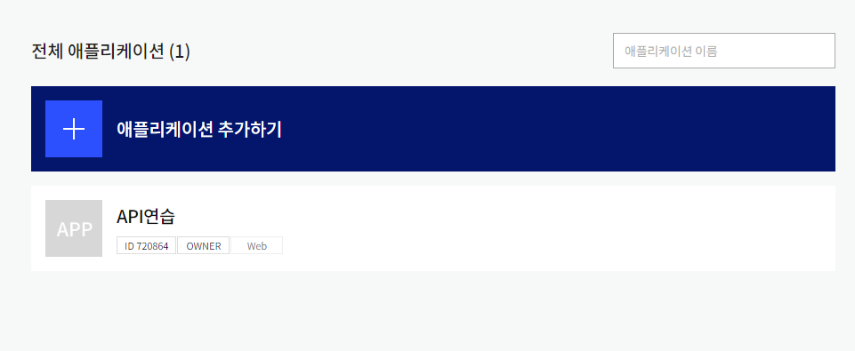
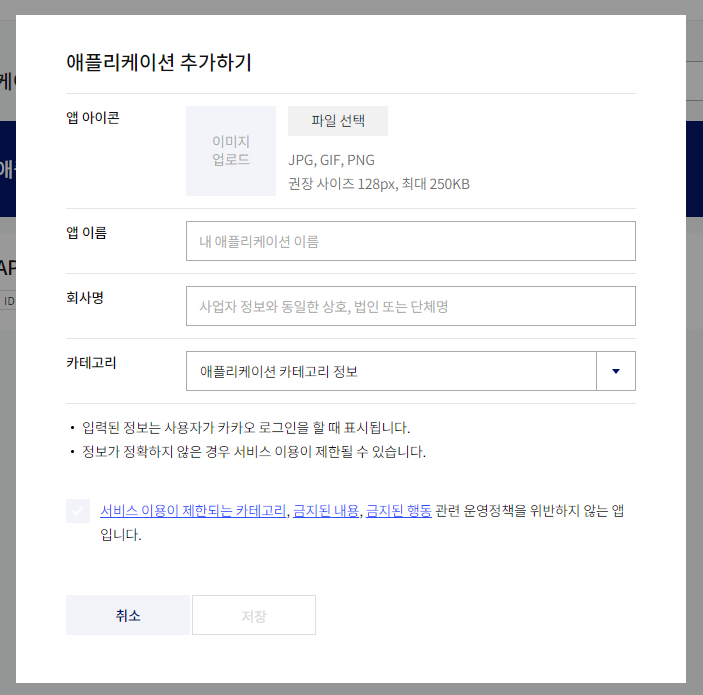
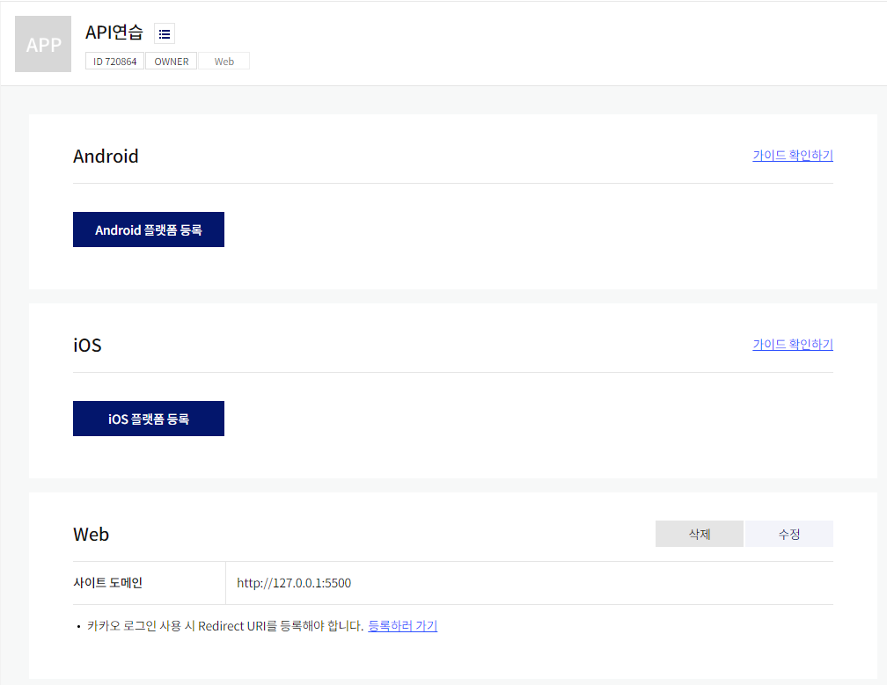
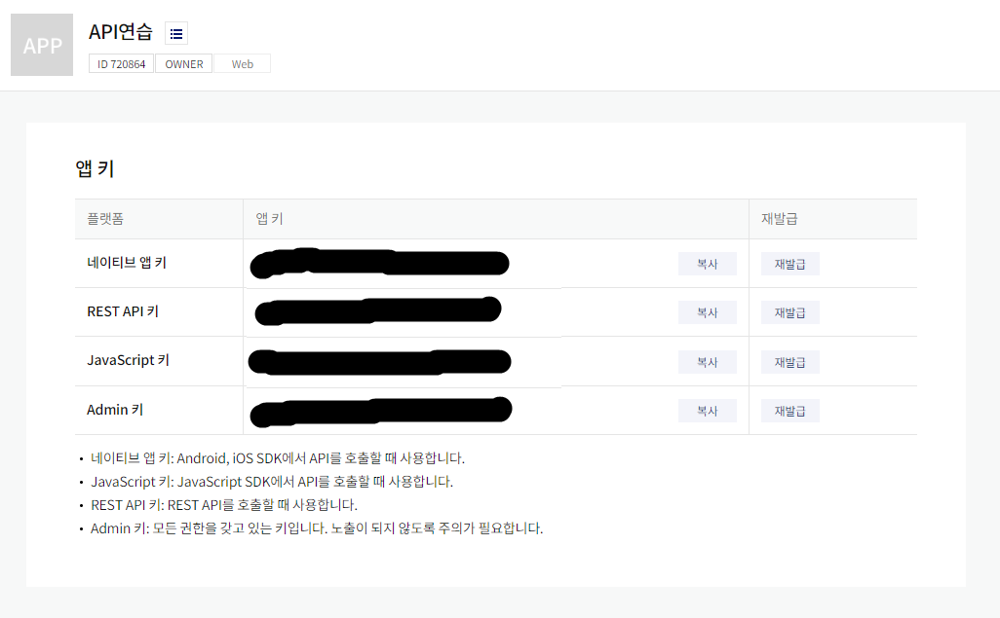

# 카카오맵 api 사용하기
## 1. 카카오 개발자 사이트 접속
[카카오 개발자](https://developers.kakao.com/)

   

## 2. 앱 생성
   
   

## 3. 플랫폼 등록
* 앱설정 > 플랫폼으로 이동

 

## 4. 앱 키
* 앱설정 > 앱 키
 
* 지도를 표출시키기 위해서는 javaScript 키가 필요하다.